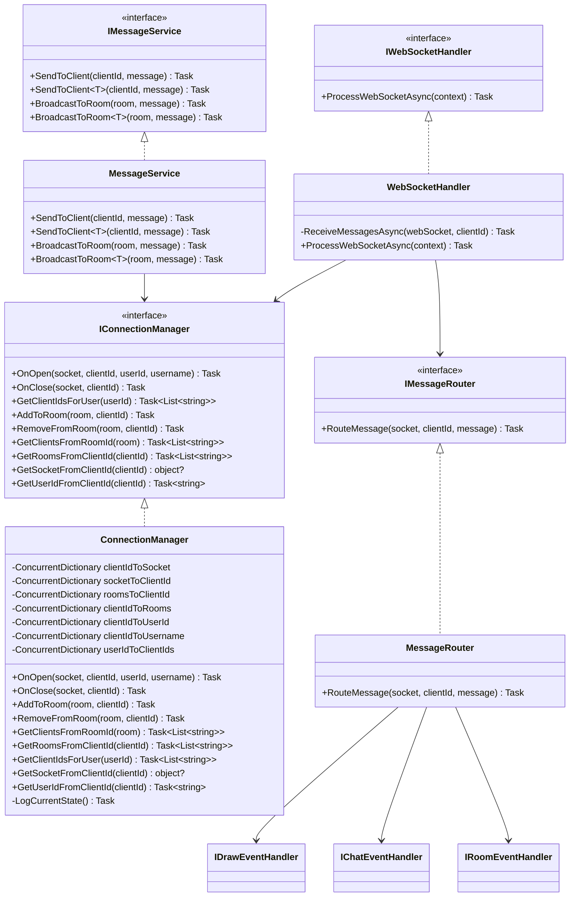

# Deployed at
    https://drawit-459009.web.app/

## PostgreSQL Requirement

This application requires PostgreSQL to be running locally for development. The application uses Entity Framework Core migrations to set up and maintain the database schema.

### Prerequisites
- PostgreSQL installed and running on port 5432
- Default credentials: username `postgres`, password `postgres`
- Default database: `postgres`

### Database Connection
The application is configured to connect to a local PostgreSQL instance with these settings:
```
Host=localhost;Port=5432;Database=postgres;Username=postgres;Password=postgres;
```

### Database Migrations
When the application starts, it automatically runs database migrations to ensure the schema is up to date. This happens in the `Program.cs` file:

```csharp
using (var scope = app.Services.CreateScope())
{
    try
    {
        var dbContext = scope.ServiceProvider.GetRequiredService<PictionaryDbContext>();
        Console.WriteLine("Attempting database migration...");
        dbContext.Database.Migrate();
        Console.WriteLine("Database migration completed successfully");
    }
    catch (Exception ex)
    {
        Console.WriteLine($"Database migration error: {ex.Message}");
    }
}
```

# Pictionary Game Architecture

The Pictionary game is built with a clean, layered architecture. Below are diagrams showing the overall architecture and key subsystems.

## Server Architecture Overview


## WebSocket Communication Flow

This diagram shows how real-time messages flow through the system:


## Repository Pattern Implementation

This diagram shows how the repository pattern is implemented:


## Real-Time Communication Components

This diagram focuses on the WebSocket infrastructure:

